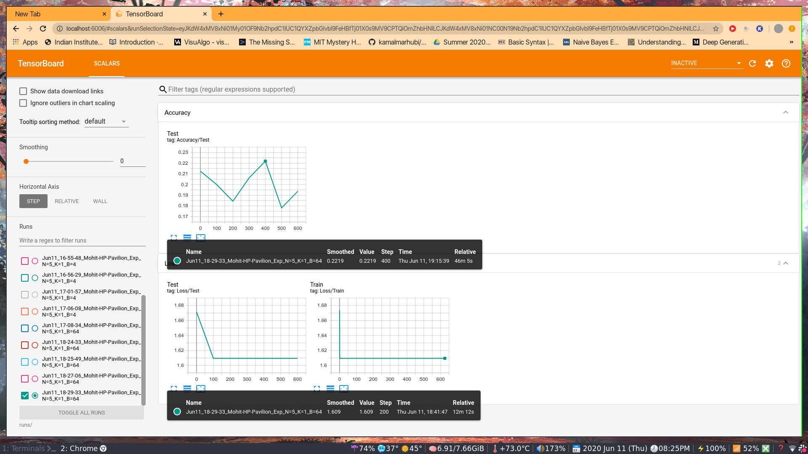

## Pytorch implementation of Memory Augmented Neural Network(Santoro et al.)

Download the omniglot Dataset from [here](https://github.com/brendenlake/omniglot) and put all the images(evaluation + background) in one folder. Then run resize_images.py there. 

Basic implementaion is in mann_pytorch.ipynb 

### Tasks Completed
- [x] Basic Implementation of MANN using LSTM
- [x] Fix Training loss error
- [x] PreFetching Dataloader added
- [ ] Training for:-
    - 5 shot 1 way
    - 4 shot 2 way
- [ ] Use Bi-LSTM/multi layered LSTM
- [ ] Use a siamese network as its head(wont work most probably)
- [ ] Use NTM module

#### When ran for 259steps model shows expected behavior.Loss is decreasing and accuracy is varied(expected). Must run this for about 20k steps. Time taken is quite high rn.

